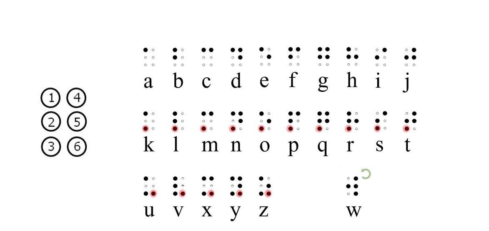

```{r setup, include = FALSE}
library("papaja")
library(tidyverse)
library(dendextend)
library(RColorBrewer)
library(factoextra)
library(dplyr)
```

```{r analysis-preferences}
# Seed for random number generation

set.seed(142)
knitr::opts_chunk$set(cache.extra = knitr::rand_seed, warning = FALSE)


BrailleDotsTable <- miceadds::load.Rdata2( filename="BrailleDotsTable.RData")

```

# Introduction

\pga{Pablo's comments look like this}

\abl{Ana's comments look like this}

\mpl{Manolo's comments look like this}

\jadl{Jon Andoni's comments look like this}


\pga{
I propose the following organization for the paper:
1. Why is it important to know the features of characters in alphabetic systems"
2. Explain what Braille is
3. Say briefly what was done expirically and statistically

We dont need the numberging below;It is moslty to keep track
}

\pga{Why}

For most sighted people, the small raised dot patterns that configure braille characters feel like little more than an undifferentiated textured surface.  Similarly, when we see graphemes of an alphabet or that we are unfamiliar with, it is hard to distinguish among the different symbols that, for the untrained eye, look "alike". However, expert readers (of braille, or any other writing system) automatically extract the critical features in letters, mostly unbothered by their accidental features. Indeed, there is a long tradition in the visual word recognition literature that has reliably demonstrated that the extraction of the relevant letter features to form abstract orthographic representations is quite robust to many manipulations [see @carreiras2012priming; @dehaene2005neural; @grainger2008letter; @pelli2006feature]. On this general basis, many studies have been devoted to the examination of the similarity/confusability of letters in various alphabets [e.g., Roman: @simpson2013letter; see also @Mueller_2012 for a review; Arabic: @Boudelaa_2020; @Wiley_2016], which has allowed researchers to carry out further investigations in reading and word recognition while controlling for letter similarity (\abl{CITE: e.g., XXXX Marcet...}), and examine ways to   \abl{Say something about expertise effects -> WILEY. and that together --> move towards a comprehensive understanding of letter identification and reading}

In  visual reading research, a consensus has emerged regarding the extraction of features from the retinal image; in other words, we do not simply use the pattern of pixels, but instead we use lines, angles, and curves as the building blocks for letter recognition. However, braille letter perception has been far less studied and, therefore, its theoretical accounts have been discussed and examined in a smaller extent. Here we aim to understand what the features of braille letters are, and whether such features change depending on braille literacy. 

Braille is unique among writing systems for many reasons. Of course, the most obvious one is that it was developed to be used by blind people though the sense of touch. Hence, it was devised taking into account the specific characteristics of the sensory modality at play, reflecting a compromise between amount of information and the skin's acuity. Importantly, the braille system is also significantly different from other contemporary writing systems because it is a modern invention (published in 1829; @braille1829procedure) that has remained essentially unchanged since Louis Braille engineered it. In contrast, visual writing systems currently in used have evolved through cultural contact and ergonomic constraints over thousands of years.

Braille is a system of embossed dots whose basic unit is *the cell*, an array of 2x3 dots in which the different variations of raised dots form the elements of the written language (e.g., z = \braille{z}, ! = \braille{!}). Hence, an important characteristic of the braille writing system is its simplicity. Indeed, as @Millar_2003 said, "Braille characters are bound to be similar to each other since they all derive from the same (2×3) matrix" (p. 32). In addition, braille is highly standardized in the shape and size of the matrix with minor variations in the standards set by different regulatory bodies; hence, there are not *glyphs* in braille. 

An explanation of how Luis Braille devised the system is in order. As can be seen in Figure \ref{fig:BrailleAlphabet}, the first 10 characters in the latin alphabet (a-j) are written using the top two rows of dots \braille{a b c d e f g h i j}, the next ten letters (k-t) repeat the patterns of the previous ten, adding a dot in the 3rd position  \braille{k l m n o p q r s t}, the next group of letters (u - z) also repeat the pattern but add a dot in the 6th position \braille{u v x y z}. The w, not being part of the French alphabet when Louis Braille created this writing system, was later assigned the character \braille{w}. \pga{"Later developments have include braille characters that are specific to particular langauges, for example, in English there areletter combiations such as "th" \braille{{th}} and "ch" \braille{{ch}}, and in Spanish there are character for accepted letters like á \braille{{of}} or ñ \braille{{er}}}" .

\abl{briefly what has been done regarding confusion matrices and letter perception}

\abl{confusion matrices: loomis, craigh}

\abl{letter perception: millar}

One of the initial hypotheses on braille letter perception suggested that braille letters were perceived holistically, by their "global shape" (e.g., \abl{CITE: Nolan \& Kederis, 1969}). Nonetheless, in a series of experiments, \abl{CITE: Millar 1977 a, b, 1985, see also 2003...} showed that was not the case, since ...\abl{explain results: high accurafcy in same/different but not able to recall/drawing...}. Indeed, Millar suggested that braille lacks prominent features and that letter perception in braille initially depends on dot density ("texture"), and that once learning has taken place, then shape coding occurs (i.e., the dots within a character can be located by reference to each other -> spatial organization)

... \abl{link to what we're doing -- even though "braille letters are bound to be similar to each other"...are all of them equally similar?}

...\pga{Also, are there primitives in braille such as "vertical line" \braille{l}}

It is unclear from the literature the extent to which braille letters are similar to each other. Here...

\pga{Brief intro on what we are doing}

- choice of task (common in visual modality) -> speeded same-different judgments for letter pairs (this task allows for normal perception conditions, while limiting the influence of task irrelevant knowledge, such as vocabulary knowledge) -> speeded = apparatus

- confussion matrices to examine what determines letter similarity in braille -> as research in visual modality

- Expertise effects in letter perception

- Dots/position weights -> is any position more important? Given that we know how it was created...(dot 3, 6...)


\abl{importance}

Theoretical and practical reasons ... 

\abl{limitations on interpretation}

The comparison between groups of course is not perfect: braille readers have greater tactile sensitivity in addition to knowledge about braille letters, and sighted individuals might use strategies, such as to mentally visualize the pattern, that are influenced by their vision experience... nonetheless, it is still possible to gain knowledge on tactile letter processing in general as well as the way literacy affects it, which, in turn, will assist on the improvement of teaching (practical) and models of word recognition and reading (theoretical)...


```{r BrailleAlphabet}


```


# Experiment 1: Similarity judgements by naïve braille readers


## Method

### Participants

86 undergraduate students at DePaul University, who did not know how to read braille, were recruited through the subject pool system. All of them gave informed consent before their participation and earned one course-credit for taking part in the study. With this sample size, we wanted to ensure each pair of different letters was observed a minimum of 15 times (considering pairs containing the same two different letters in the opposite order as being different pairs [e.g., \braille{l} \braille{f} different from \braille{f} \braille{l}], and taking into account that some trials may be lost in data cleaning). 

### Apparatus

We devised a system to control the presentation timing of braille stimuli while maintaining the needed movement of the fingertips across the braille letters from left to right. This system consists in a refreshable braille display placed on a motorized platform that moves the display horizontally at a set speed and distance. Hence, with this system we slid the braille letters on the braille display against participants fingers, instead of having participants moving their fingers from left to right to perceive the letters (\abl{see Appendix X for a a more detailed description and visualization of the apparatus}). In addition, we used 3D stickers to indicate the area where the braille letters would appear, serving as reference points (start & end). 

\abl{maybe add something like: even though this is not the most ecological way to read, participants' performance while using this "passive-haptic" method was similar to their performance using the active exploration of the patterns (MA Thesis)}. 


### Materials

The study used all possible 2-letter combinations (n = 676) pairs. Out of those pairs, 26 were formed by the same two letters (e.g., \braille{f} \braille{f}), and 650 formed by two different letters (e.g., \braille{f} \braille{t}). In order to have the same amount of trials per condition (i,e., *same* and *different*), we created five different lists of pairs, each of them with 130 *same pairs*, and 130 *different pairs*. Hence, each participant perceived 266 trials, 6 practice plus 260 target trials. The order of presentation of the target trials was randomized for each participant. 

**3 PARTICIPANTS (87-89) ONLY 210!**

### Procedure

The experiment took place individually in a quiet room. We placed the refreshable braille display + moving platform system in the pull-out keyboard tray of the desktop, to avoid participants seeing the braille characters, and the keyboard used to respond on the desktop. Participants were instructed to place their index fingertip on the start position (after the first 3D sticker), to let the braille display slide against it, and to classify the two letters perceived as being *the same* two letters or as being two *different* letters--the letters "m" or "n" on the keyboard, respectively, with the non-dominant hand.  

The braille display moved for 5 cm at 38.9 mm/s (35.9 mm/rev x 65 rpm / 60). This speed was chosen considering previous studies on passive touch (see Vega-Bermudez et al., 1991), as well as our own experience testing it. After moving said distance, the display stopped until participants responded and reset its position during the one-second ITI. The experimental session took around 30 minutes to complete.

### Data analysis

Participants whose accuracy was below 51%, and trials in which response times (RTs) were either fatser than 600ms (time to)

Participants who performed at chance level or below, and trials in which responses were either faster than 200 ms or slower than 15000 ms were excluded from the analysis. Table 1 shows the mean accuracy per group and condition.

## Results

```{r data set rawE1, message=FALSE, warning=FALSE}
library("papaja")
library(tidyverse)
library(dendextend)
library(RColorBrewer)
library(factoextra)
library(dplyr)
library(kableExtra)
```


```{r data, message=FALSE, warning=FALSE}

ItemNumber <- array(1: 676)

same <- tibble( Pairs = paste (letters, letters))%>%
  mutate(Order = 0)

different1<- t(combn(letters, 2))%>%
  as_data_frame()%>%
  mutate(Pairs = paste(V1, V2),
         Order = 1)%>%
  select(Pairs, Order)

different2 <- t(combn(letters, 2))%>%
  as_data_frame()%>%
  mutate(Pairs = paste(V2, V1),
         Order = 2)%>%
  select(Pairs, Order)
    
AllStimuli <-  bind_rows(same,different1, different2)%>%
  bind_cols(ItemNumber)%>%
  rename(ItNumber = "...3")

Rawdata_Sighted_E2 <- miceadds::load.Rdata2( filename="RawData_DePaul.RData")%>%
  filter(Experiment == 2,
         Key == "m" | Key == "n")%>%
  select(-Experiment)%>%
  drop_na()%>% #28 NA (2 key presses...)
  mutate(Pairs = paste(IT1, IT2))%>%
  merge(AllStimuli, by = "Pairs")
  
  
OverallAcc_Sighted_perSubject <-  Rawdata_Sighted_E2%>%
  group_by(Subject)%>%
  summarise(mean(accuracy))%>%
  filter(`mean(accuracy)` <.51)

ToRemove <- list(OverallAcc_Sighted_perSubject$Subject) # Participants whose acc < .51

Sighted <- Rawdata_Sighted_E2%>%
  filter(Subject != "P46E2" & Subject != "P67E2"  & Subject != "P69E2" & Subject != "P77E2" & Subject != "P89E2") # Removed 1242 observations


Sighted_clean <- Sighted %>%
  filter(RT > 0.6)%>%
  filter(RT < 12)%>% # removed 179 observations
  mutate(rubricC = ifelse(rubric == "m",0.5,-0.5))


#Checking
N_obs_different<- Sighted_clean%>%
  filter(rubric=="n")%>%
  group_by(IT1,IT2)%>%
  count()

min(N_obs_different$n) #14 obs min

```

```{r bayes t test, message=FALSE, warning=FALSE}


## Acc by subjects

Sighted_Same_Acc <- Sighted_clean%>%
  filter(rubricC == 0.5)%>%
  group_by(Subject)%>%
  summarise(MAcc = mean(accuracy))

Sighted_Diff_Acc <- Sighted_clean%>%
  filter(rubricC == -0.5)%>%
  group_by(Subject)%>%
  summarise(MAcc = mean(accuracy))

BayesFactor::ttestBF(Sighted_Same_Acc$MAcc, Sighted_Diff_Acc$MAcc, paired = T) # "same" trials more accurate than "different" trials

## RT by subjects

Sighted_Same_RT <- Sighted_clean%>%
  filter(rubricC == 0.5)%>%
  group_by(Subject)%>%
  summarise(MRT = mean(RT))

Sighted_Diff_RT <- Sighted_clean%>%
  filter(rubricC == -0.5)%>%
  group_by(Subject)%>%
  summarise(MRT = mean(RT))


BayesFactor::ttestBF(Sighted_Same_RT$MRT, Sighted_Diff_RT$MRT, paired = T) # no difference in RT between "same" and "different" trials

```

```{r ACCURACY distance matrix sighted , message=FALSE, warning=FALSE}

Different_sighted<- Sighted_clean%>%
  filter(rubric == "n")

matrix.acc.sighted<-tapply(Different_sighted$accuracy, list(Different_sighted$IT1, Different_sighted$IT2),mean)%>%
  round(3)

# Check if it's ok making it symmetric

sym.acc.matrix.sighted <- (matrix.acc.sighted + t(matrix.acc.sighted))/2

#write.table((round(sym.acc.matrix.sighted,3)), 'M.csv', col.names=NA) 

```

```{r RT distance matrix sighted, message=FALSE, warning=FALSE}


CorrectDifferent.norm.sighted<- Different_sighted%>%
  filter(accuracy == 1)%>%
  mutate(RTms = RT*1000)%>%
  group_by(Subject)%>%
  mutate(MRT_subj = mean(RTms))%>%
  ungroup()%>%
  mutate(normTime = RTms/MRT_subj) 

#Normalizing RTs so mean RT = 1 per subject (as in Courrieu et al., 2004 & Wiley et al., 2016)


matrix.rt.sighted<-tapply(CorrectDifferent.norm.sighted$normTime, list(CorrectDifferent.norm.sighted$IT1, CorrectDifferent.norm.sighted$IT2),mean)%>%
  round(3)
    
sym.rt.matrix.sighted <- (matrix.rt.sighted + t(matrix.rt.sighted))/2
kable(round(sym.rt.matrix.sighted,3))


#Transform similarity matrix it into a dissimilarity matrix:

diss.rt.matrix.sighted <- 1/sym.rt.matrix.sighted
kable(round(diss.rt.matrix.sighted,3))

#write.table((round(diss.rt.matrix.sighted,3)), 'RT_matrix.csv', col.names=NA) 

```

```{r Hierarchical clustering sighted, message=FALSE, warning=FALSE}

# ACCURACY

## Euclidian method (because of previous articles):

dist.res.acc.sighted<-dist(sym.acc.matrix.sighted, method = "euclidian")

        ## What linkage method to use
          
        ### define linkage methods
        
        m <- c( "average", "single", "complete", "ward")
        names(m) <- c( "average", "single", "complete", "ward")
        
        ### function to compute agglomerative coefficient:
        
        ac1 <- function(x) {
          cluster::agnes(dist.res.acc.sighted, method = x)$ac
        }
        
        ### calculate agglomerative coefficient for each clustering linkage method
        
        sapply(m, ac1)
        
        ## we'll use ward's method (Note that agnes(*, method="ward") corresponds to hclust(*, "ward.D2"))


dend.acc.sighted<- hclust(dist.res.acc.sighted, method = "ward.D2")%>%
  as.dendrogram()

plot(dend.acc.sighted)
order.hclust(hclust(dist.res.acc.sighted, method = "ward.D2"))


# RT

dist.res.rt.sighted<-dist(diss.rt.matrix.sighted, method = "euclidian")


        ## What linkage method to use

        ac2 <- function(x) {
          cluster::agnes(dist.res.rt.sighted, method = x)$ac
        }
      
        
        sapply(m, ac2)
        
        ## we'll use ward's method


dend.rt.sighted<- hclust(dist.res.rt.sighted, method = "ward.D2")%>%
  as.dendrogram()

plot(dend.rt.sighted)

## Optimal number of clusters

sym.acc.matrix1.sigh<- sym.acc.matrix.sighted%>%
  gdata::lowerTriangle()%>%
  as_data_frame()

fviz_nbclust(sym.acc.matrix1.sigh, kmeans, method = "wss") +
    geom_vline(xintercept = 4, linetype = 2)+
  labs(subtitle = "Elbow method - accuracy")


diss.rt.matrix1.sigh<- diss.rt.matrix.sighted%>%
  gdata::lowerTriangle()%>%
  as_data_frame()

fviz_nbclust(diss.rt.matrix1.sigh, kmeans, method = "wss") +
    geom_vline(xintercept = 4, linetype = 2)+
  labs(subtitle = "Elbow method - Rtdiss")

## 4 (both accuracy & rt)

```


```{r Dendrograms with color sighted , message=FALSE, warning=FALSE}

dend.acc4.sigh<- dend.acc.sighted %>% 
  set("branches_k_color", value = c( "dodgerblue2", "darkolivegreen3","darkorange2", "darkorchid3"), k = 4)%>%
  plot(horiz =F, main = "Accuracy")

dend.rt4.sigh<- dend.rt.sighted%>% 
  set("branches_k_color", value = c("darkorchid3", "darkorange2","dodgerblue2" ,"darkolivegreen3"), k = 4)%>%
  plot(horiz = F, main = "RT")


cluster_assignments_acc.sigh <- cutree(hclust(dist.res.acc.sighted, method = "ward.D2"), 4)
cluster_assignments_rt.sigh <- cutree(hclust(dist.res.rt.sighted, method = "ward.D2"), 4)

```


```{r models, message=FALSE, warning=FALSE}

# NOT DONE 

```

## Discussion


# Experiment 2: Ciegos

### Motor Control

- file = "motor_control_BF-ino"
- speed = 7000rpm (left to right); 260 rpm (right to left --> because of Miguel)
- distance = 250 steps (~4.5cm)

#### REMEMBER. To calculate speed: 

1. steps/mm = 200*1/2*20 = 5
2. mm/rev = 200/5 = 40 (IN VALENCIA - CHI different because different pulley)
3. mm/sec = 40*rpm/60


## Method


### Participants

24 blind adult individuals...

### Material

All combinations. 5 lists (some 4... PANDEMIC)

### Procedure

### Data analysis

## Results


```{r raw data blind, message=FALSE, warning=FALSE}
ItemNumber <- array(1: 676)

same <- tibble( Pairs = paste (letters, letters))%>%
  mutate(Order = 0)

different1<- t(combn(letters, 2))%>%
  as_data_frame()%>%
  mutate(Pairs = paste(V1, V2),
         Order = 1)%>%
  select(Pairs, Order)

different2 <- t(combn(letters, 2))%>%
  as_data_frame()%>%
  mutate(Pairs = paste(V2, V1),
         Order = 2)%>%
  select(Pairs, Order)
    
AllStimuli <-  bind_rows(same,different1, different2)%>%
  bind_cols(ItemNumber)%>%
  rename(ItNumber = "...3")

files <- list.files(pattern="*.RData")
for (i in 1:length(files)) {
  load(files[i])
}

RawdataBF <- P10JPRaw%>%
  bind_rows(P13MGMRaw,P14FGLRaw,P18ACSRaw,P1MMSRaw,P20RTGRaw,P21PCRaw,P22RicRaw,P23EMRaw,P25SGRaw,P26KaRaw,P27YRaw,P28BeRaw,P29MLRaw,P2CPSRaw,P30JuRaw,P31IsRaw,P32VaRaw,P33SERaw,P3JMURaw,P4CGMRaw,P5LSRaw,P6CGBRaw,P7DRRaw)%>%
  mutate(SubjectID = stringr::str_remove(pattern = "_.*", Subject), SubjectID = sub("x","",SubjectID), SubjectID = sub("y","",SubjectID), SubjectID = sub("P","",SubjectID), RT = as.double(RT), Pairs = paste(IT1, IT2))%>%
  merge(AllStimuli, by = "Pairs")

#save(RawdataBF, file = "RawdataBF.RData")

RawdataBF_k <- RawdataBF%>%
  filter(KEY == "m" | KEY == "n")

CleanBF<- RawdataBF_k%>%
  drop_na()%>%
  filter(RT > .6 & RT < 12)

```

```{r ACCURACY distance matrix blind, message=FALSE, warning=FALSE}

Different.blind<- CleanBF%>%
  filter(Rubric == "n")

matrix.acc.blind<-tapply(Different.blind$Accuracy, list(Different.blind$IT1, Different.blind$IT2),mean)%>%
  round(3)


    # Can we make it symmetric?
    
    Acc.Order1 <- Different.blind%>%
      filter(Order==1)%>%
      group_by(ItNumber,Pairs)%>%
      summarise(MAcc1 = mean(Accuracy))%>%
      ungroup()
    
    Acc.Order2 <-Different.blind%>%
      filter(Order==2)%>%
      group_by(ItNumber,Pairs)%>%
      summarise(MAcc2 = mean(Accuracy))%>%
      ungroup()
    
    Acc.orders <- bind_cols(Acc.Order1,Acc.Order2)%>%
      mutate(difference = MAcc1 - MAcc2,
             OrderMatters = if_else(difference > (abs(.05)),"T",""))
    
    t.test(Acc.orders$MAcc1,Acc.orders$MAcc2, paired = T)
    
    ## YES
    
    ## for those whose acc differ in more than 5%: 
    n_acc<-Acc.orders%>%
      filter(OrderMatters=="T") #33/325 differ in more than 5% accuracy. 


sym.acc.matrix.blind <- (matrix.acc.blind + t(matrix.acc.blind))/2

#write.table((round(sym.acc.matrix,3)), 'M.csv', col.names=NA) 

```

```{r RT distance matrix, message=FALSE, warning=FALSE}


CorrectDifferent.norm.blind<- Different.blind%>%
  filter(Accuracy == 1)%>%
  mutate(RTms = RT*1000)%>%
  group_by(SubjectID)%>%
  mutate(MRT_subj = mean(RTms))%>%
  ungroup()%>%
  mutate(normTime = RTms/MRT_subj) 

#Normalizing RTs so mean RT = 1 per subject (as in Courrieu et al., 2004 & Wiley et al., 2016)


matrix.rt.blind<-tapply(CorrectDifferent.norm.blind$normTime, list(CorrectDifferent.norm.blind$IT1, CorrectDifferent.norm.blind$IT2),mean)%>%
  round(3)

    # Can we make it symmetric?
    
    RT.Order1.blind <- CorrectDifferent.norm.blind%>%
      filter(Order==1)%>%
      group_by(ItNumber,Pairs)%>%
      summarise(MNRT1 = mean(normTime))%>%
      ungroup()
    
    RT.Order2.blind <- CorrectDifferent.norm.blind%>%
      filter(Order==2)%>%
      group_by(ItNumber,Pairs)%>%
      summarise(MNRT2 = mean(normTime))%>%
      ungroup()
    
    RT.orders.blind <- bind_cols(RT.Order1.blind,RT.Order2.blind)%>%
      mutate(difference = MNRT1 - MNRT2,
             OrderMatters = if_else(difference > (abs(.05)),"T",""))
    
    t.test(RT.orders.blind$MNRT1,RT.orders.blind$MNRT2, paired = T)
    
    ## YES

    
sym.rt.matrix.bl<- (matrix.rt.blind + t(matrix.rt.blind))/2
kable(round(sym.rt.matrix.bl,3))


#Transform similarity matrix it into a dissimilarity matrix:

diss.rt.matrix.bl <- 1/sym.rt.matrix.bl
kable(round(diss.rt.matrix.bl,3))

#write.table((round(diss.rt.matrix,3)), 'RT_matrix.csv', col.names=NA) 

```

```{r Hierarchical clustering bl, message=FALSE, warning=FALSE}
# ACCURACY

## Euclidian method (because of previous articles):

dist.res.acc.bl<-dist(sym.acc.matrix.blind, method = "euclidian")

        ## What linkage method to use
          
        ### define linkage methods
        
        m <- c( "average", "single", "complete", "ward")
        names(m) <- c( "average", "single", "complete", "ward")
        
        ### function to compute agglomerative coefficient:
        
        ac1 <- function(x) {
          cluster::agnes(dist.res.acc.bl, method = x)$ac
        }
        
        ### calculate agglomerative coefficient for each clustering linkage method
        
        sapply(m, ac1)
        
        ## we'll use ward's method (Note that agnes(*, method="ward") corresponds to hclust(*, "ward.D2"))


dend.acc.bl<- hclust(dist.res.acc.bl, method = "ward.D2")%>%
  as.dendrogram()

plot(dend.acc.bl)
order.hclust(hclust(dist.res.acc.bl, method = "ward.D2"))


# RT

dist.res.rt.bl<-dist(diss.rt.matrix.bl, method = "euclidian")


        ## What linkage method to use

        ac2 <- function(x) {
          cluster::agnes(dist.res.rt.bl, method = x)$ac
        }
      
        
        sapply(m, ac2)
        
        ## we'll use ward's method


dend.rt.bl<- hclust(dist.res.rt.bl, method = "ward.D2")%>%
  as.dendrogram()

plot(dend.rt.bl)

## Optimal number of clusters

sym.acc.matrix1.bl<- sym.acc.matrix.blind%>%
  gdata::lowerTriangle()%>%
  as_data_frame()

fviz_nbclust(sym.acc.matrix1.bl, kmeans, method = "wss") +
    geom_vline(xintercept = 4, linetype = 2)+
  labs(subtitle = "Elbow method - accuracy")


diss.rt.matrix1.bl<- diss.rt.matrix.bl%>%
  gdata::lowerTriangle()%>%
  as_data_frame()

fviz_nbclust(diss.rt.matrix1.bl, kmeans, method = "wss") +
    geom_vline(xintercept = 4, linetype = 2)+
  labs(subtitle = "Elbow method - Rtdiss")

## 4 (both accuracy & rt)

```


```{r Dendrograms with color bl, message=FALSE, warning=FALSE}

dend.acc4.bl<- dend.acc.bl %>% 
  set("branches_k_color", value = c( "dodgerblue2", "darkolivegreen3","darkorange2", "darkorchid3"), k = 4)%>%
  plot(horiz =F, main = "Accuracy")

dend.rt4.bl<- dend.rt.bl%>% 
  set("branches_k_color", value = c("darkorchid3", "darkorange2","dodgerblue2" ,"darkolivegreen3"), k = 4)%>%
  plot(horiz = F, main = "RT")


cluster_assignments_acc.bl <- cutree(hclust(dist.res.acc.bl, method = "ward.D2"), 4)
cluster_assignments_rt.bl <- cutree(hclust(dist.res.rt.bl, method = "ward.D2"), 4)

```

```{r}
 
# MODELS

```


## Discussion


# General Discussion


\newpage

# References

\begingroup
\setlength{\parindent}{-0.5in}
\setlength{\leftskip}{0.5in}

<div id="refs" custom-style="Bibliography"></div>
\endgroup
